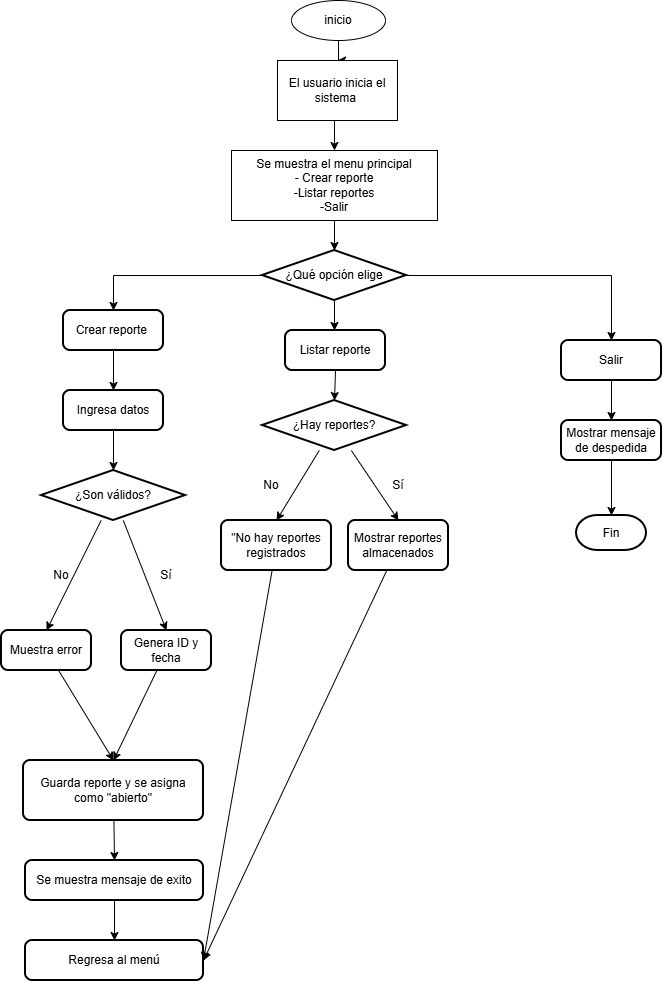

# Act1B3TS

Sistema básico de **Gestión de Tickets** desarrollado en **TypeScript** para ejecutarse desde consola. El programa permite crear y listar tickets de incidentes mediante un menú interactivo.

## Descripción

Este proyecto simula un sistema sencillo de registro de incidencias, donde el usuario puede crear nuevos tickets, asignarles una prioridad y almacenar la información en memoria durante la ejecución del programa.

Cada ticket contiene:
- ID generado automáticamente.
- Título del incidente.
- Descripción.
- Nombre de la persona que realiza el reporte.
- Prioridad del ticket.
- Estado inicial del ticket.
- Fecha de creación.

## Requisitos previos

Antes de ejecutar el proyecto es necesario contar con las siguientes herramientas instaladas:

| Herramienta | Versión recomendada |
|-------------|--------------------|
| Visual Studio Code | Última versión |
| Node.js | 22.x LTS o superior |
| npm | 10.x o superior |
| pnpm | 11.5.1 o superior |
| TypeScript | Incluido en las dependencias del proyecto |

### Verificar instalación

En una terminal de VS Code ejecutar:

```bash
node -v
npm -v
pnpm -v
```

Si alguno de estos comandos no funciona, es necesario instalar o configurar la herramienta correspondiente.

## Instalación del entorno

### 1. Instalar Node.js

Descargar e instalar la versión LTS desde:
https://nodejs.org/

### 2. Habilitar la ejecución de scripts en PowerShell (si es necesario)

Si aparece el error relacionado con `npm.ps1`, ejecutar:

```powershell
Set-ExecutionPolicy -Scope CurrentUser RemoteSigned
```

### 3. Instalar pnpm

El proyecto utiliza **pnpm** como administrador de paquetes.

```bash
npm install -g pnpm
```

Verificar la instalación:

```bash
pnpm -v
```

## Instalación del proyecto

Clonar el repositorio https://github.com/dgiron-2025071/Act1B3TS.git y cambiar a la rama dgiron-2025071 para cargarlo todo.

Ubicarse en la carpeta principal del proyecto y ejecutar:

```bash
pnpm install
```

Este comando descargará e instalará todas las dependencias necesarias.

## Ejecución del programa

Una vez instaladas las dependencias, ejecutar el siguiente comando:

```bash
pnpm start
```

El programa iniciará en la terminal mostrando el menú principal.

## Funcionamiento del sistema

Al iniciar, el sistema presenta un menú con tres opciones:

```
1. Crear reporte
2. Listar reportes
3. Salir
```

### Crear ticket
El usuario debe ingresar:
- Título del incidente.
- Descripción.
- Nombre de la persona que realiza el reporte.
- Prioridad (Baja, Media, Alta o Inmediata).

El sistema valida que:
- El título no esté vacío.
- La prioridad ingresada sea válida.

Si toda la información es correcta:
- Se genera un ID automáticamente.
- Se asigna el estado inicial **"Abierto"**.
- Se registra la fecha de creación.
- El ticket se almacena en memoria.

### Listar tickets
Muestra todos los tickets registrados, incluyendo:
- ID.
- Título.
- Prioridad.
- Estado.
- Usuario que reportó el incidente.
- Fecha de creación.

Si no existen tickets registrados, el sistema informa al usuario.

### Salir
Finaliza la ejecución del programa y muestra un mensaje de despedida.

##  Estructura básica del proyecto

```
Act1B3TS/
│
├── incidentesdag/
│   ├── script.ts
│   ├── package.json
│   ├── tsconfig.json
│   └── ...
│
└── README.md
```

## Tecnologías utilizadas

- TypeScript
- Node.js
- pnpm
- prompt-sync
- Visual Studio Code

## Notas importantes (mucho ojo profe)

- El almacenamiento de los tickets es temporal; al cerrar el programa, la información se pierde.
- Los IDs se generan automáticamente de forma incremental.
- El sistema se ejecuta completamente desde la consola de Visual Studio Code.

## Autor

Proyecto desarrollado como práctica académica para la implementación de un sistema básico de gestión de tickets utilizando TypeScript y programación orientada a objetos.

---

## Diagrama de flujo solicitado 

